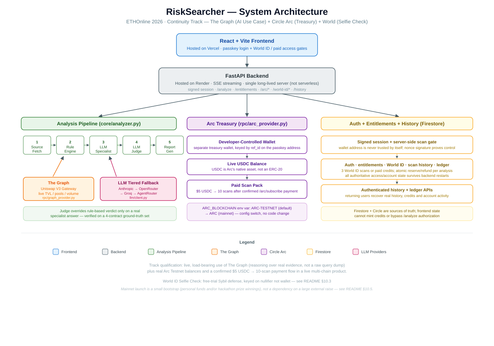
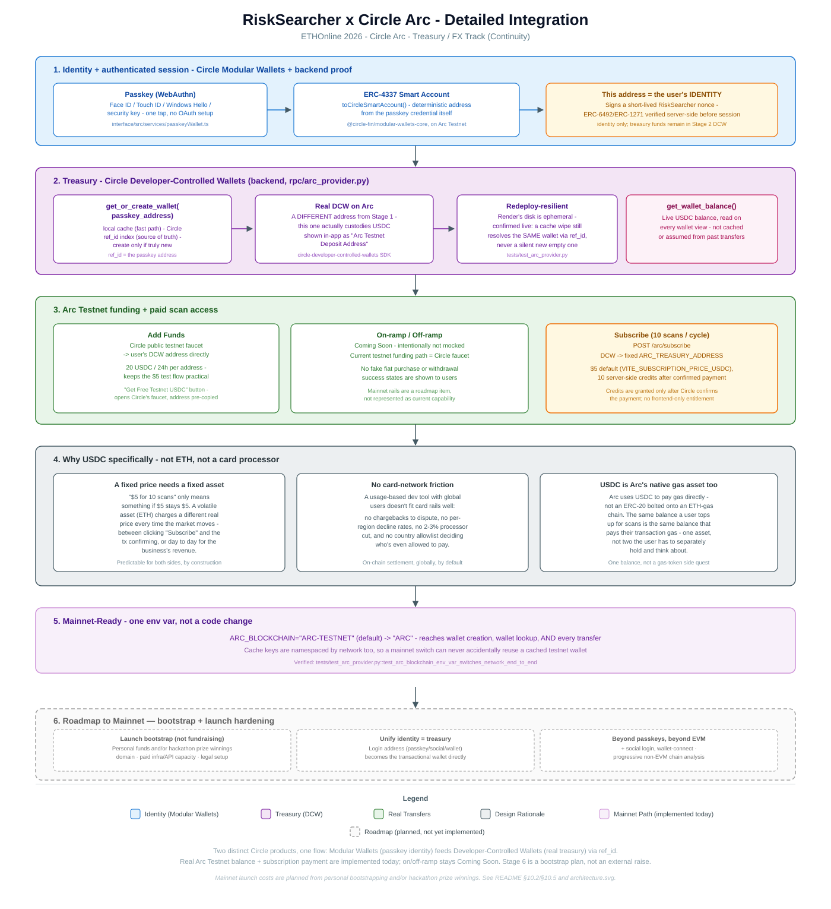

# RiskSearcher

**A full-stack smart-contract risk intelligence product for Ethereum and EVM-compatible chains.**

Paste a contract address, choose a chain, and RiskSearcher streams a verdict, score, reasoning, bytecode/source evidence, transaction-risk signals, and live liquidity context into the browser. Access is protected by passkey authentication, World ID human verification for the free trial, and USDC scan credits on Circle Arc.

**Live product:** https://risksearcher.vercel.app

The original analysis engine still works from the CLI, but the hackathon build turns it into a user-facing product with authentication, payments, Sybil-resistant access, persisted history, live on-chain data, and server-enforced entitlements.

---

## 1. The problem

**Who has it:** anyone about to buy, ape into, or interact with an ERC-20 contract they didn't write — retail traders, degen-chat regulars, or a small team doing quick due diligence before a listing decision. I've personally validated 5,000+ contracts and earned 50,000+ points as a SpotBlock contract validator, so this problem and its bottleneck are ones I've lived at real scale, not a hypothetical.

**Now standalone and user-facing:** RiskSearcher started as a validator agent I built to contribute to SpotBlock, a community project scanning reported contracts. It's now decoupled from SpotBlock's queue/wallet-submission flow entirely — anyone can run it directly on any address, not just contracts already reported into SpotBlock's system.

**What the bottleneck actually looks like today:** before trusting a contract, that person has to manually:
- Open Etherscan and read the verified source, if it's verified at all.
- If it isn't verified, read raw bytecode by hand — selectors, opcodes — which requires EVM literacy almost nobody casually trading has.
- Cross-reference the transaction history for drain patterns, wash activity, or spam designed to look like legitimate volume.
- Filter out hype- and bot-driven search results, which are often the loudest signal for exactly the tokens worth being suspicious of.

None of this is hard for an expert. It's slow, expertise-gated, and inconsistent between reviewers — and the tokens that most need scrutiny (fresh launches, unverified source, honeypots) are exactly the ones where this manual process breaks down fastest. A contract can look completely clean in a naive rule scan and still be an active honeypot, because the exploit lives in *why* a function behaves the way it does, not just *whether* a risky-sounding function exists.

**What "solving it well" means now:** a user should not need Solidity expertise, a local Python environment, or five browser tabs. They open RiskSearcher, sign in with a passkey, verify as a unique human for a small free trial or buy scan credits in USDC, paste a contract address, and watch the analysis stream live. The result is persisted to their account with the evidence and reasoning needed to act on it.

## 2. Baseline

The baseline used for comparison is the **real manual process above** — not another AI chatbot, not a simpler script. That's what a person actually does today when they don't have a tool like this. I've done this manual process myself, repeatedly, including a fresh pass just now for this comparison, on the same four ground-truth contracts used to evaluate RiskSearcher.

| Metric | Manual baseline (Etherscan + search, done by me) | RiskSearcher | Change |
|---|---|---|---|
| Correct verdict | 2/4 — WETH and Dolphin's drain are catchable by careful manual review; FARTPEPE's honeypot hides in a `tx.origin`-gated view function I would not have caught by eye without already knowing to look for it; Shrimp's zero-value spam is easy to over-flag as suspicious from raw transfer count alone | 4/4 | +2 correct |
| Reading verified source | Slow and error-prone once a contract passes a few hundred lines — some of these run past 1,000 lines, and tracing one conditional through multiple functions by hand is where mistakes happen | Full pipeline run in minutes | Minutes vs. what can be a long, careful read for a complex contract |
| Reading unverified bytecode/opcodes | Genuinely hard — this isn't a "takes longer" problem, it requires EVM-level expertise most users, and even most blockchain devs, don't have | Same in seconds, no expertise required | Makes an entire class of contracts analyzable at all for a non-expert |
| Reading transaction history | Slow and easy to miss patterns once a contract has more than a handful of transactions — manually eyeballing dozens or hundreds of transfers for drain/concentration patterns doesn't scale | Seconds, systematically checks every transfer | Minutes/manual-only vs. seconds, and catches patterns a manual skim would miss |
| Consistency | Depends on my own attention and Solidity fluency that day — the FARTPEPE miss above is a real example of that | Same evidence, same reasoning path, every run | Removes reviewer-dependent variance |

FARTPEPE is the hard case worth calling out explicitly: it's the one contract where my own manual review, done honestly, would have missed the actual mechanism — which is exactly the gap RiskSearcher's LLM specialist+judge layer was built to close. A pure rule-based pass on it scores 5/SAFE; the full pipeline (rules + LLM specialist + judge) correctly flags it 80/UNSAFE by reasoning about the `tx.origin`-gated `balanceOf()` override that no static rule, and no quick manual read, was ever going to catch.

## Prior state of the project

RiskSearcher existed before ETHOnline as a **CLI-only smart-contract analysis engine**. There was no React frontend, no deployed FastAPI/SSE product API, no wallet/passkey identity, no paid scan flow, no World ID trial gate, and no per-user account/ledger experience. The hackathon work turned that engine into the deployed product shown in this submission.

See [`docs/PRIOR_STATE.md`](./docs/PRIOR_STATE.md) for a stable record of the pre-hackathon project. In short, the starting point was a local/CLI risk-analysis engine: rules, scoring, transaction analysis, FAISS patterns, an LLM client, RPC access, and regression tests. It did **not** have a production web app, API/SSE streaming, user accounts, passkey authentication, World ID, Circle/Arc payments, scan entitlements, Firestore account state, per-user ledger/history, or The Graph liquidity evidence.


## What changed during ETHOnline 2026

The hackathon work is the productization layer **and** the sponsor integrations that made RiskSearcher usable as a real service rather than only a local analysis engine.

| Before the hackathon | Built during ETHOnline 2026 | Why it matters |
|---|---|---|
| Local/CLI analysis flow | **React + Vite web product** deployed on Vercel | A non-technical user can scan a contract from a browser instead of cloning a repo and running Python |
| Synchronous local execution | **FastAPI backend + SSE streaming** on Render | Users see analysis stages and results as they happen instead of waiting on a silent long-running request |
| No user identity | **Circle Modular Wallet passkey login** with WebAuthn / ERC-4337 smart accounts | Passwordless sign-in using Windows Hello, Face ID, Touch ID, Android biometrics, or a security key |
| No proof that a submitted wallet belongs to the caller | **Signed backend nonce + ERC-6492/ERC-1271 smart-account verification + server sessions** | The API no longer trusts an arbitrary `user_address`; direct calls must prove control of the passkey smart account |
| No free-trial abuse protection | **World ID Selfie Check** with server-side proof verification and nullifier-based claim tracking | One verified human can claim **3 free scans**, even if they try another wallet/browser |
| No payment rail | **Circle Developer-Controlled Wallet on Arc Testnet** | Each user gets a real Arc treasury wallet resolved by Circle `ref_id`; the UI shows the real balance, never a seeded/demo balance |
| No paid access model | **$5 USDC → 10 scan credits** | A real Arc Testnet USDC payment funds a usable scan pack; credits are granted server-side only after payment confirmation |
| CLI-only local interface; no web access-control layer | **Deployed React/Vite product + authenticated FastAPI/SSE backend + server-side entitlement ledger** | Users can scan from the browser, while `/analyze` is protected server-side and every fresh scan/re-analysis consumes an entitlement |
| No durable user account state | **Firestore auth, entitlement, World ID, ledger and scan-history stores** | Refreshes/redeploys do not reset who paid, who verified, or what a user scanned |
| Analysis lacked decentralized liquidity context | **The Graph Gateway / Uniswap V3 liquidity evidence** | TVL, pool count, pool age and swap-volume evidence feeds the specialist's reasoning and appears in the UI |
| No account activity view | **Real per-user Ledger Activity** | The account page reflects actual service-credit and wallet activity rather than mock `$50` deposits or fake allocations |
| No product access UX | **Responsive scanner, access gates, account/pricing/docs views, real balance/faucet guidance** | Users are prompted to verify or subscribe before scanning, analysis auto-scrolls into view, and mobile/desktop flows are usable |
| No mainnet path for payments | **`ARC_BLOCKCHAIN` network switch and network-scoped wallet lookup/cache** | The Arc integration is structured for a testnet → mainnet configuration change instead of a rewrite |

Two UX decisions are intentionally explicit in the current testnet product: **on-ramp and off-ramp are marked Coming Soon** rather than mocked, and testnet users are sent to the faucet to fund the real Arc wallet. The product does not pretend testnet USDC has real-world value.

## 3. What RiskSearcher does

Given one address and a chain, RiskSearcher runs a five-stage pipeline and produces a single verdict, score, and human-readable report:

```
[1/5] Fetch contract source (Etherscan V2, multi-chain)
[2/5] Run rule-based analysis (bytecode selectors/opcodes, source scan, behavioral tx analysis, FAISS similarity)
[3/5] Run LLM specialist analysis (balance/access-control focus)
[4/5] Run LLM judge pass (only if the specialist produced a real answer)
[5/5] Generate the markdown report
```

- **Etherscan source checks** when the contract is verified — full source is scanned for known-dangerous patterns (owner-gated transfers, blacklist/freeze hooks, upgrade backdoors, etc.).
- **RPC bytecode + chain context** via Alchemy, used both when source is unverified and as ground truth alongside source when it is.
- **Source and bytecode scanning rules** (`core/rules.py`) — selector and opcode pattern matching, byte-value correct (not string-substring — using integer byte-value comparisons rather than unsafe string-substring matching).
- **Transaction behavior analysis** (`core/tx_analysis.py`) — honeypot/drain and outbound-concentration checks, filtered to real-value transfers only, so zero-value spam transfers (a common phishing/airdrop-populate tactic) can't masquerade as a drain.
- **Live liquidity evidence from The Graph** (`rpc/graph_provider.py`) — queries The Graph Gateway's Uniswap V3 Ethereum-mainnet subgraph for a token's total USD liquidity, pool count, first observed swap, and 24-hour/7-day swap volume. Those figures are sent as a named evidence block to the LLM specialist, which must reason about thin or very new liquidity and volume/liquidity mismatches as legitimacy and liquidity-pull signals; they are also shown in the report. If `GRAPH_API_KEY` is unavailable or the query has no data, the pipeline records that explicitly and continues without treating absence as a safety signal.
- **FAISS similarity search** (`db/vector_store.py`) against a seeded corpus of known scam patterns, with writes scoped to confirmed patterns only so the corpus can't self-contaminate from its own prior verdicts.
- **A tiered LLM specialist + judge pass** — the actual agentic layer, described in detail below — that can override the rule-based verdict when it has real evidence to justify it, and is skipped cleanly when it doesn't.

**Primary workflow — deployed web product:**

1. Open **https://risksearcher.vercel.app**.
2. Create or sign in to a Circle passkey smart account.
3. Claim **3 free scans** after World ID Selfie Check, or purchase **10 scans for $5 USDC** on Arc Testnet.
4. Paste a contract address and choose the EVM network.
5. RiskSearcher streams the five analysis stages over SSE, then renders the verdict, evidence, The Graph liquidity data, and reasoning in the browser.
6. The scan and account activity are persisted for that authenticated user.

**CLI remains available for local/developer use:**
```bash
python main.py
```
The CLI still runs the core engine directly and is useful for scripting and regression work, but it is no longer the main product experience.

---

## 4. The agentic layer: specialist → judge, with fallback tiers

This is the part that turns RiskSearcher from a rule-based scanner into an agent-driven decision system, and it's the part worth reading closely.

### 4.1 Why a judge pass exists at all

Early on, LLM specialist output was attached to the report *without* affecting the verdict — a deliberate stopgap to avoid double-counting rule-based and LLM findings before real aggregation logic existed. That was wrong for the actual goal: a rule engine cannot detect a `balanceOf()` override that lies conditionally on `tx.origin`. Only something that reads and reasons about the source can. So the rule is now explicit:

> If an LLM specialist genuinely ran and returned a real answer (through *any* configured backend/tier — not a simulated or rule-based fallback), that answer goes to a second LLM call — **the judge** — which reconciles it with the rule-based findings and produces the actual final verdict, severity, and score. The pure rule-based verdict is only used when no LLM backend answered at all.

This branch is explicit in `core/analyzer.py`, in the same visible style as the existing source-mode/bytecode-mode branch — not buried in an implicit fallback path. See `tests/test_verdict_branching.py` for the behavior this locks in (judge success overrides the rule-based verdict; judge failure or no real specialist response falls back to it cleanly).

### 4.2 Active provider fallback (`llm/client.py`)

The specialist uses the providers that proved reliable for the deployed backend, in this order:

**Specialist provider order:**
1. **Anthropic direct** (`claude-opus-5`) when `ANTHROPIC_API_KEY` is configured.
2. **OpenRouter** (`openrouter/free`) as the next cloud fallback.
3. **Groq** using `openai/gpt-oss-120b`, then `openai/gpt-oss-20b`.
4. **No usable LLM response** → keep the deterministic rule-based verdict and record `verdict_source: rule_based`.

A missing key simply skips that provider. Authentication failures stop retrying that provider, while transient failures such as rate limits, timeouts, or empty responses move the specialist to the next available provider/model instead of crashing the scan.

**Judge behavior:** once the specialist succeeds, the judge deliberately reuses the **same provider and model** that produced the specialist result (`tests/test_verdict_branching.py::test_judge_reuses_same_provider_and_model_as_specialist`). That keeps one analysis internally consistent. If that judge call fails or returns invalid output, RiskSearcher falls back to the deterministic rule-based verdict and records the judge failure instead of manufacturing a verdict or silently hiding the discrepancy.

**Report-level consequence:** the final report always shows *which layer actually produced the displayed verdict and score* — `Verdict source: LLM judge` or `Verdict source: rule-based` — and keeps the raw rule-based score visible separately even when the judge overrides it, so nothing about the rule-based reasoning is hidden by the override (see `reports/Token_0x42eDA424.md` for a real example: judge-driven score 80/UNSAFE/high, rule-based score 5 kept for reference).

### 4.3 What never leaks to the terminal

Full contract source is sent to the LLM in the specialist/judge prompts, but it is never printed to stdout — including under the `LLMPRINTPROMPT` debug flag, which shows prompt *structure* only, with `SOURCE_FILES:` replaced by a placeholder pointing at a redacted debug log under `reports/llm_debug/`. Terminal output after a run completes is deliberately minimal: verdict, score, one-line reason, path to the full report. Everything else — source, full breakdown, specialist text, judge reasoning — lives only in the generated `.md` report.

---

## 5. Quick start

### Use the deployed product

Open **https://risksearcher.vercel.app** and use the passkey flow. On Arc Testnet, fund the displayed wallet from the faucet; on-ramp/off-ramp buttons are intentionally marked **Coming Soon** rather than simulated.

Current access model:
- **World ID verified human:** 3 free scans, one trial claim per World ID nullifier.
- **Paid scan pack:** $5 USDC on Arc Testnet → 10 scans.
- **No entitlement:** `/analyze` is rejected by the backend, even if someone bypasses the frontend.

### Run locally

```bash
pip install -r requirements.txt
cp config.env .env
# fill the required provider/server values
python main.py
```

For the full web product, run the FastAPI backend and the Vite frontend with the environment variables documented in `config.env` and `interface/.env.example`. Server secrets must stay on the backend; do not expose them through `VITE_*` variables.

The CLI works with zero LLM keys configured by falling back to the deterministic/rule-based verdict. The deployed product uses the same core analysis engine behind the API.

---

## 6. Architecture



### Circle/Arc payment and entitlement flow



The Arc-specific diagram shows the passkey identity layer, authenticated backend session, Circle Developer-Controlled Wallet, USDC scan-pack payment, confirmation, and server-side credit allocation end to end.

```text
RiskSearcher/
├── api/
│   └── server.py              # FastAPI + SSE, authenticated /analyze, Arc, World ID, history, entitlement APIs
├── core/
│   ├── analyzer.py            # Rules -> Graph evidence -> specialist -> judge -> report
│   ├── rules.py               # Source/bytecode selector + opcode checks
│   ├── scoring.py             # Deterministic risk scoring
│   ├── tx_analysis.py         # Real-value transaction behavior analysis
│   └── report.py              # Human-readable analysis output
├── rpc/
│   ├── provider.py            # Etherscan V2 + Alchemy multi-chain data
│   ├── graph_provider.py      # The Graph Gateway / Uniswap V3 liquidity evidence
│   ├── arc_provider.py        # Circle Developer-Controlled Wallets + Arc USDC payments
│   ├── smart_account_auth.py  # ERC-6492/ERC-1271 passkey smart-account verification
│   └── world_id_provider.py   # World ID server-side proof + RP-context verification
├── db/
│   ├── auth_store.py          # Nonces/sessions for authenticated smart-account access
│   ├── entitlement_store.py   # Free/paid credits, payment state, atomic scan reservations, ledger
│   ├── world_id_store.py      # Nullifier-keyed one-human free-trial claims
│   ├── scan_history_store.py  # Per-user persisted scan history
│   ├── vector_store.py        # FAISS scam-pattern similarity search
│   └── patterns.json
├── interface/                 # React + Vite frontend (Vercel)
│   └── src/
│       ├── services/          # auth, entitlements, Arc, World ID, history, SSE analysis APIs
│       └── components/        # scanner, account/ledger, pricing, passkey, World ID, subscription UI
├── tests/                     # Engine + Graph + Arc + World ID + auth/entitlement/API regressions
├── docs/
│   ├── PRIOR_STATE.md          # Stable pre-hackathon state
|   ├── world-selfie-check-feedback.md # World Selfie Check sandbox and integration feedback
│   └── diagrams/
│       ├── architecture.svg   # Full product architecture
│       └── architecture-arc.svg # Circle/Arc payment + entitlement flow
├── main.py                    # Secondary local/CLI entry point
├── config.env                 # Backend environment template
└── requirements.txt
```

The critical security boundary is the backend: possessing or typing a wallet address is not authentication. RiskSearcher creates a short-lived challenge, verifies the Circle smart-account signature, issues a session, and then checks/reserves scan entitlement server-side before analysis begins.

---

## 7. Ground-truth evaluation set

Four contracts, chosen to stress different parts of the pipeline:

| Contract | What it tests | Verdict |
|---|---|---|
| FARTPEPE (`0x42eDA4...`) | Honeypot only detectable by reasoning about a `tx.origin`-gated `balanceOf()` override — pure rules score it 5/SAFE; the LLM specialist+judge layer correctly flags 80/UNSAFE/high | UNSAFE (LLM judge) |
| WETH9 (`0xC02aaA...`) | Clean, heavily-used contract — should stay SAFE and not false-positive on any rule | SAFE |
| "Shrimp" (`0x0bed28...`) | 200/200 zero-value inbound transfers (phishing/airdrop-populate spam) — must be flagged low-severity, not escalated to a false Honeypot/Drain finding | THREAT (score 70, correctly downgraded from a false 135) |
| "Dolphin" (`0x92df13...`) | Real-value drain + outbound concentration to a single address — must stay high-severity | THREAT (score 95, unchanged) |

Shrimp and Dolphin are near-identical in raw transfer *count* but completely different in real *value moved* — that pair is what caught a real honeypot/drain heuristic bug in an earlier build phase.

---

## 8. Scoring notes

- `THREAT_THRESHOLD` controls the `THREAT` verdict boundary for the rule-based score.
- When the LLM judge produces a real verdict, the report's top-line score reflects the judge's severity, not the stale rule-based number — the rule-based score is retained separately and labeled, never hidden.
- Lower-level selector/opcode/behavior detection lives entirely in the rule engine (`core/rules.py`, `core/tx_analysis.py`) and is unaffected by whether an LLM tier is available.

---

## 9. AI-assisted development

AI coding tools were used during development for implementation assistance, debugging, documentation, and code review. Architecture, integration decisions, product design, testing, and final implementation decisions were directed and validated by the project author.

---

## 10. Security note

Keep secrets and provider keys in local environment files only; do not commit them to source control. Full contract source is sent to configured LLM providers as part of specialist/judge prompts — review your provider's data-handling terms if that matters for your use case.

---

## 11. ETHOnline 2026 — Track Submissions

RiskSearcher is submitted in the **Continuity pool** (extending the pre-existing repo documented in [`docs/PRIOR_STATE.md`](./docs/PRIOR_STATE.md)) for three tracks. All three integrations are live, tested, and load-bearing — not stubs added for qualification.

### 11.1 The Graph — Best AI Tooling or AI Use Case (Continuity)

RiskSearcher is a **risk monitor** (the track's own example category — *"research assistants, trading and execution agents, portfolio copilots, risk monitors"*), not a tooling submission, so the reusable-infrastructure bar applies to the tooling half of the track, not to this.

- **Live data, not mocked:** [`rpc/graph_provider.py`](./rpc/graph_provider.py) queries The Graph's Gateway for the Uniswap V3 Ethereum-mainnet subgraph — real total liquidity, pool count, first-swap timestamp, and 24h/7d swap volume, via a Subgraph Studio API key.
- **Load-bearing use:** this evidence is injected directly into the LLM specialist's prompt ([`core/analyzer.py`](./core/analyzer.py)), which is explicitly instructed to reason about thin/new liquidity and volume-to-liquidity mismatches as legitimacy signals — not just display raw numbers.
- **Defensive data handling:** pool enumeration now returns the expected pool data for tested tokens. `pools_data_reliable` remains as a guardrail for future upstream/API inconsistencies: if liquidity is present but pool-level data is internally inconsistent, RiskSearcher marks those fields unavailable instead of turning missing data into a misleading confirmed zero.
- **Visible in the product**, not just the backend: a "Live Liquidity — The Graph" panel renders real TVL, pool count, pool age, and swap volume directly in the scan report UI.

### 11.2 Circle Arc — Treasury / FX Track

- **Passkey identity:** [`interface/src/services/passkeyWallet.ts`](./interface/src/services/passkeyWallet.ts) uses Circle **Modular Wallets** to create/recover a WebAuthn-secured ERC-4337 smart account. The backend then challenges that account and verifies its ERC-6492/ERC-1271 signature before creating a RiskSearcher session. The wallet address is never trusted merely because the browser supplied it.
- **Real Arc treasury wallet:** [`rpc/arc_provider.py`](./rpc/arc_provider.py) creates/resolves a Circle **Developer-Controlled Wallet** on Arc, keyed by Circle `ref_id` to the authenticated passkey address. The account view reads the live USDC balance; there is no seeded `$50` or demo balance.
- **Real paid scan pack:** the current testnet plan is **$5 USDC for 10 scans**. `/arc/subscribe` initiates the real transfer to `ARC_TREASURY_ADDRESS`; the backend persists the Circle transaction and grants the 10 credits only after Circle reports a confirmed payment state. A frontend success callback cannot manufacture entitlement.
- **Server-enforced consumption:** [`db/entitlement_store.py`](./db/entitlement_store.py) owns free and paid credits. `/analyze` atomically reserves a credit before work begins; a failed analysis refunds it. This prevents direct-API bypasses, re-analysis bypasses, concurrent double-spend and refresh-based credit resets.
- **No fake fiat rails:** on-ramp and off-ramp are visibly **Coming Soon**. Testnet users are directed to the faucet to fund the real Arc wallet instead of seeing simulated deposits or withdrawals.
- **Real account activity:** the Ledger Activity view is generated from the authenticated user's persisted service-credit/payment activity and real wallet state, not seeded mock transactions.
- **Redeploy-resilient wallet mapping:** Circle's `ref_id` index is the source of truth, so Render's ephemeral filesystem does not silently create a new wallet after a restart.
- **Mainnet-ready network plumbing:** `ARC_BLOCKCHAIN=ARC-TESTNET` can switch to `ARC`; wallet creation, lookup and transfers all use the same network setting and network-scoped cache keys.
- **Why USDC:** the product sells a dollar-denominated scan pack, so a stable asset keeps the displayed price and paid price aligned. On Arc, USDC also serves as the native gas asset, avoiding a separate gas-token balance for the testnet payment flow.
- **What “subscription” means here:** it is a manual scan-pack purchase, not scheduled recurring billing. Each confirmed $5 payment adds 10 scan credits; RiskSearcher never implies an automatic future charge.

### 11.3 World — Selfie Check (Sybil-Resistant Free Trial)

RiskSearcher gates its free trial (3 scans) behind [World ID Selfie Check](https://docs.world.org/world-id/credentials/11), using it exactly as the track intends — as an abuse-prevention signal, not a decorative badge.

- **Real server-side verification, not client-trusted state:** [`rpc/world_id_provider.py`](./rpc/world_id_provider.py) calls World's actual verify endpoint (`POST /api/v4/verify/{rp_id}`) with the complete IDKit proof; the frontend's own "success" state is never trusted on its own.
- **The actual Sybil-defense mechanism:** [`db/world_id_store.py`](./db/world_id_store.py) keys the trial-claim ledger on the World ID **nullifier** — a stable per-human identifier — not on wallet address, using Firestore's atomic document-create as the claim mechanism. A verified human cannot reconnect a fresh wallet to claim a second trial; confirmed live, the app correctly surfaces *"This World ID has already claimed a free trial with 0x71c8...4337"* on a repeat attempt from a different device.
- **RP-signature generation, verified byte-for-byte:** World ID 4.0 requires every request to carry a signed `rp_context`. The official `@worldcoin/idkit-server` package refuses to run outside genuine Node.js (confirmed the hard way — it hung indefinitely on Vercel's Edge runtime, then explicitly rejected running there once the runtime mismatch was fixed), so signing was ported to Python instead and checked byte-for-byte against the real JS source's message construction, hashing, and a self-consistent sign/recover round-trip before being trusted.
- **Cross-device session restoration:** verification is bound to a human, not a browser — [`db/world_id_store.py`](./db/world_id_store.py)'s `get_claim_status_by_wallet_address()` lets a returning user's *other* device recognize an existing verification via wallet address, not just a locally-cached nullifier from the device that originally verified.

### 11.4 What each track's evidence looks like end-to-end

| Requirement | Where to see it |
|---|---|
| Graph: live data feeding real reasoning | Run a scan (`main.py` or the deployed app) on a token with a Uniswap V3 pool — see the "Live Liquidity" section of the report and the specialist's reasoning about it |
| Graph: defensive reliability guard | `tests/test_graph_provider.py::test_nonzero_tvl_with_zero_pools_is_marked_unreliable` |
| Arc: real paid access | Purchase the $5 scan pack in the app / call `/arc/subscribe` while authenticated — a confirmed Circle transaction grants 10 server-side scan credits |
| Arc: mainnet-ready | `tests/test_arc_provider.py::test_arc_blockchain_env_var_switches_network_end_to_end` |
| Arc: redeploy-resilient identity | `tests/test_arc_provider.py::test_finds_existing_wallet_via_ref_id_after_cache_loss` |
| World: one-trial-per-human enforced | `tests/test_world_id_store.py::test_status_by_wallet_address_finds_an_existing_claim` |
| World: cross-device status lookup | `tests/test_api_world_id_endpoint.py::test_status_falls_back_to_address_when_no_nullifier` |

### 11.5 Path to Mainnet & Forward Roadmap

Everything above this line is implemented and tested today. This section is explicitly the opposite — plans, not claims — kept separate so it's never mistaken for current capability.

**Mainnet launch is planned as a small bootstrap, not a large external fundraising dependency.** The Arc network switch itself is already configuration-driven (`ARC_BLOCKCHAIN=ARC`, §11.2). Before enabling real-value payments, I plan to cover the modest launch costs with **personal bootstrapping and/or hackathon prize winnings**: a production domain, paid backend/API capacity, and the basic legal/operational setup appropriate for handling real user funds.

The point is not “RiskSearcher needs major funding before it can work.” The product already works on Arc Testnet. The remaining spend is normal launch hardening before moving a financial flow from test assets to real USDC.

**Planned architecture change — unifying identity and treasury:** on mainnet, the two-address split described in §11.2 (a passkey identity address, separate from a backend-managed DCW treasury address linked by `ref_id`) is planned to collapse into one. Whichever login method a user chooses — passkey, social login, or a connected external wallet — its resulting address becomes their transactional wallet directly, with no separate backend-created account to reconcile. This is planned specifically for compliance clarity (one address, one identity, one audit trail) and a simpler launch surface, not because the current two-address design is broken — it works and is tested (§11.2) — but a unified model is the right long-term shape for a mainnet financial product.

**Planned login expansion:** passkeys (implemented today) plus social login and external wallet-connect as additional, equally-first-class options — not passkey-only.

**Planned analysis expansion beyond EVM:** chain support for the actual risk analysis is planned to grow progressively beyond EVM chains, not just add more EVM networks to the existing list.

Also live in this submission: authenticated per-user **scan history**, **scan entitlements**, and **Ledger Activity** persisted in Firestore. Returning users recover the account state that matters instead of getting a fresh mock/session-only account after every browser refresh.

## Contact

LinkedIn: [Therock Ani](https://www.linkedin.com/in/therock-ani-13336224b/)
