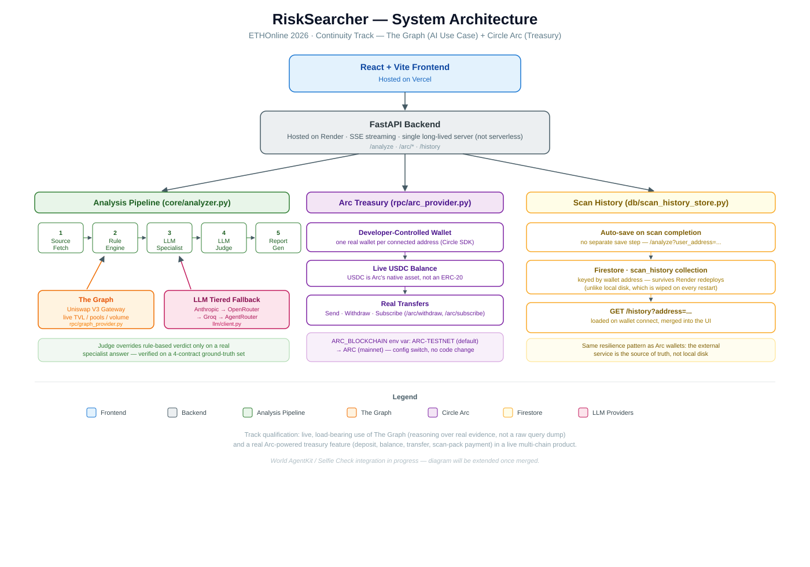

 # RiskSearcher

**Single-address smart contract risk analysis for Ethereum and EVM-compatible contracts.**

Paste a contract address, pick a chain, get a verdict — with the reasoning that produced it, not just a score.

---

## 1. The problem

**Who has it:** anyone about to buy, ape into, or interact with an ERC-20 contract they didn't write — retail traders, degen-chat regulars, or a small team doing quick due diligence before a listing decision. I've personally validated 5,000+ contracts and earned 50,000+ points as a SpotBlock contract validator, so this problem and its bottleneck are ones I've lived at real scale, not a hypothetical.

**Now standalone and user-facing:** RiskSearcher started as a validator agent I built to contribute to SpotBlock, a community project scanning reported contracts. It's now decoupled from SpotBlock's queue/wallet-submission flow entirely — anyone can run it directly on any address, not just contracts already reported into SpotBlock's system.

**What the bottleneck actually looks like today:** before trusting a contract, that person has to manually:
- Open Etherscan and read the verified source, if it's verified at all.
- If it isn't verified, read raw bytecode by hand — selectors, opcodes — which requires EVM literacy almost nobody casually trading has.
- Cross-reference the transaction history for drain patterns, wash activity, or spam designed to look like legitimate volume.
- Filter out hype- and bot-driven search results, which are often the loudest signal for exactly the tokens worth being suspicious of.

None of this is hard for an expert. It's slow, expertise-gated, and inconsistent between reviewers — and the tokens that most need scrutiny (fresh launches, unverified source, honeypots) are exactly the ones where this manual process breaks down fastest. A contract can look completely clean in a naive rule scan and still be an active honeypot, because the exploit lives in *why* a function behaves the way it does, not just *whether* a risky-sounding function exists.

**What "solving it well" means:** replacing that whole manual sequence with one command — `python main.py` — that returns a verdict a person can actually act on, with the evidence spelled out, in about a minute.

## 2. Baseline

The baseline used for comparison is the **real manual process above** — not another AI chatbot, not a simpler script. That's what a person actually does today when they don't have a tool like this. I've done this manual process myself, repeatedly, including a fresh pass just now for this comparison, on the same four ground-truth contracts used to evaluate RiskSearcher.

| Metric | Manual baseline (Etherscan + search, done by me) | RiskSearcher | Change |
|---|---|---|---|
| Correct verdict | 2/4 — WETH and Dolphin's drain are catchable by careful manual review; FARTPEPE's honeypot hides in a `tx.origin`-gated view function I would not have caught by eye without already knowing to look for it; Shrimp's zero-value spam is easy to over-flag as suspicious from raw transfer count alone | 4/4 | +2 correct |
| Reading verified source | Slow and error-prone once a contract passes a few hundred lines — some of these run past 1,000 lines, and tracing one conditional through multiple functions by hand is where mistakes happen | Full pipeline run in minutes | Minutes vs. what can be a long, careful read for a complex contract |
| Reading unverified bytecode/opcodes | Genuinely hard — this isn't a "takes longer" problem, it requires EVM-level expertise most users, and even most blockchain devs, don't have | Same in seconds, no expertise required | Makes an entire class of contracts analyzable at all for a non-expert |
| Reading transaction history | Slow and easy to miss patterns once a contract has more than a handful of transactions — manually eyeballing dozens or hundreds of transfers for drain/concentration patterns doesn't scale | Seconds, systematically checks every transfer | Minutes/manual-only vs. seconds, and catches patterns a manual skim would miss |
| Consistency | Depends on my own attention and Solidity fluency that day — the FARTPEPE miss above is a real example of that | Same evidence, same reasoning path, every run | Removes reviewer-dependent variance |

FARTPEPE is the hard case worth calling out explicitly: it's the one contract where my own manual review, done honestly, would have missed the actual mechanism — which is exactly the gap RiskSearcher's LLM specialist+judge layer was built to close. A pure rule-based pass on it scores 5/SAFE; the full pipeline (rules + LLM specialist + judge) correctly flags it 80/UNSAFE by reasoning about the `tx.origin`-gated `balanceOf()` override that no static rule, and no quick manual read, was ever going to catch.

## Prior state of the project

See [`PRIOR_STATE.md`](./docs/PRIOR_STATE.md) for a full, stable record of what this project was before ETHOnline 2026 — kept separate so it doesn't get lost or reworded as this README evolves to describe the final submitted product.

## 3. What RiskSearcher does

Given one address and a chain, RiskSearcher runs a five-stage pipeline and produces a single verdict, score, and human-readable report:

```
[1/5] Fetch contract source (Etherscan V2, multi-chain)
[2/5] Run rule-based analysis (bytecode selectors/opcodes, source scan, behavioral tx analysis, FAISS similarity)
[3/5] Run LLM specialist analysis (balance/access-control focus)
[4/5] Run LLM judge pass (only if the specialist produced a real answer)
[5/5] Generate the markdown report
```

- **Etherscan source checks** when the contract is verified — full source is scanned for known-dangerous patterns (owner-gated transfers, blacklist/freeze hooks, upgrade backdoors, etc.).
- **RPC bytecode + chain context** via Alchemy, used both when source is unverified and as ground truth alongside source when it is.
- **Source and bytecode scanning rules** (`core/rules.py`) — selector and opcode pattern matching, byte-value correct (not string-substring — see the SELFDESTRUCT bug in the changelog for why that distinction matters).
- **Transaction behavior analysis** (`core/tx_analysis.py`) — honeypot/drain and outbound-concentration checks, filtered to real-value transfers only, so zero-value spam transfers (a common phishing/airdrop-populate tactic) can't masquerade as a drain.
- **Live liquidity evidence from The Graph** (`rpc/graph_provider.py`) — queries The Graph Gateway's Uniswap V3 Ethereum-mainnet subgraph for a token's total USD liquidity, pool count, first observed swap, and 24-hour/7-day swap volume. Those figures are sent as a named evidence block to the LLM specialist, which must reason about thin or very new liquidity and volume/liquidity mismatches as legitimacy and liquidity-pull signals; they are also shown in the report. If `GRAPH_API_KEY` is unavailable or the query has no data, the pipeline records that explicitly and continues without treating absence as a safety signal.
- **FAISS similarity search** (`db/vector_store.py`) against a seeded corpus of known scam patterns, with writes scoped to confirmed patterns only so the corpus can't self-contaminate from its own prior verdicts.
- **A tiered LLM specialist + judge pass** — the actual agentic layer, described in detail below — that can override the rule-based verdict when it has real evidence to justify it, and is skipped cleanly when it doesn't.

**Primary workflow:**
```bash
python main.py
```
No flags required — it's interactive: paste the address, pick a chain from a short numbered list (Enter defaults to Ethereum), and the CLI shows live per-stage progress as it runs. `--address` and `--chain` flags are still available for scripting or judges who want a non-interactive run.

---

## 4. The agentic layer: specialist → judge, with fallback tiers

This is the part that turns RiskSearcher from a rule-based scanner into an agent-driven decision system, and it's the part worth reading closely.

### 4.1 Why a judge pass exists at all

Early on, LLM specialist output was attached to the report *without* affecting the verdict — a deliberate stopgap to avoid double-counting rule-based and LLM findings before real aggregation logic existed. That was wrong for the actual goal: a rule engine cannot detect a `balanceOf()` override that lies conditionally on `tx.origin`. Only something that reads and reasons about the source can. So the rule is now explicit:

> If an LLM specialist genuinely ran and returned a real answer (through *any* configured backend/tier — not a simulated or rule-based fallback), that answer goes to a second LLM call — **the judge** — which reconciles it with the rule-based findings and produces the actual final verdict, severity, and score. The pure rule-based verdict is only used when no LLM backend answered at all.

This branch is explicit in `core/analyzer.py`, in the same visible style as the existing source-mode/bytecode-mode branch — not buried in an implicit fallback path. See `tests/test_verdict_branching.py` for the behavior this locks in (judge success overrides the rule-based verdict; judge failure or no real specialist response falls back to it cleanly).

### 4.2 Fallback tiers (`llm/client.py`)

Both the specialist call and the judge call go through the same tiered client, so a missing key or a rate-limited provider degrades gracefully instead of crashing the run:

**Specialist tier order:**
1. **Anthropic direct** (`claude-opus-5`) — used if `ANTHROPIC_API_KEY` is set. Skipped with a plain log line if not.
2. **AgentRouter** (same Anthropic-compatible SDK, different base URL and model), tried in order:
   - `deepseek-v4-flash`
   - `glm-5.3`
   - (`claude-opus-5`, `claude-opus-4-8`, `gpt-5.6-sol` are wired in but currently commented out — they're known to exhaust this project's AgentRouter quota pool; re-enable them if the pool is topped up.)
3. **No usable response from any tier** → the pipeline falls back to the pure rule-based verdict, and the report says so explicitly (`verdict_source: rule_based`).

An authentication failure (401/unauthorized) on a tier stops retrying *that tier* immediately and moves to the next one; a transient failure (rate limit, timeout, empty/"thinking-only" response) is treated as "try the next model in this tier." Each attempt also gets a generous token budget (20,000 output tokens) — an earlier version capped this at 800 tokens on the first attempt, which meant a reasoning model would sometimes spend its entire budget thinking and return no visible text at all, silently starving the judge of real findings. Raising both attempts' budgets fixed that class of failure outright.

**Judge tier:** the judge is called with the *same provider and model the specialist succeeded on* first (`tests/test_verdict_branching.py::test_judge_reuses_same_provider_and_model_as_specialist`), which keeps the reasoning consistent within one run. If that specific call fails, the judge falls through its own Anthropic → AgentRouter tier list independently, same failure semantics as above. If the judge pass fails entirely, the report keeps the rule-based verdict and records why (`judge_error`), rather than silently dropping the discrepancy.

**Report-level consequence:** the final report always shows *which layer actually produced the displayed verdict and score* — `Verdict source: LLM judge` or `Verdict source: rule-based` — and keeps the raw rule-based score visible separately even when the judge overrides it, so nothing about the rule-based reasoning is hidden by the override (see `reports/Token_0x42eDA424.md` for a real example: judge-driven score 80/UNSAFE/high, rule-based score 5 kept for reference).

### 4.3 What never leaks to the terminal

Full contract source is sent to the LLM in the specialist/judge prompts, but it is never printed to stdout — including under the `LLMPRINTPROMPT` debug flag, which shows prompt *structure* only, with `SOURCE_FILES:` replaced by a placeholder pointing at a redacted debug log under `reports/llm_debug/`. Terminal output after a run completes is deliberately minimal: verdict, score, one-line reason, path to the full report. Everything else — source, full breakdown, specialist text, judge reasoning — lives only in the generated `.md` report.

---

## 5. Quick start

### 1. Install dependencies
```bash
pip install -r requirements.txt
```

### 2. Configure environment
```bash
cp config.env .env
# Edit .env with your values
```

Required / relevant variables:
```bash
ALCHEMY_API_KEY=...        # multi-chain RPC + bytecode access
ETHERSCAN_API_KEY=...      # Etherscan V2 — one key, multiple chains, enables source verification
ANTHROPIC_API_KEY=...      # optional — first specialist/judge tier
AGENTROUTER_API_KEY=...    # optional — fallback specialist/judge tier(s)
TOOL_NAME=RiskSearcher
THREAT_THRESHOLD=30
```
RiskSearcher works with **zero** LLM keys configured — it just runs rule-based-only and says so in the report (`verdict_source: rule_based`). The LLM layer is additive, not required.

### 3. Run it
```bash
python main.py
```
Follow the prompts: contract address, then a chain (Ethereum, Base, Arbitrum, Optimism, Polygon, BNB Smart Chain, Avalanche — Ethereum and Base are the priority chains, chosen because they're where Alchemy's RPC coverage and Etherscan V2's source-verification coverage both overlap cleanly). Or skip the prompts:
```bash
python main.py --address 0xYOUR_CONTRACT_ADDRESS --chain base
```

### 4. Reproduce the full evaluation
```bash
PYTHONPATH=. pytest -q
PYTHONPATH=. python scripts/run_ground_truth.py
```
See [`REPRODUCTION.md`](./REPRODUCTION.md) for the complete reproduction guide, including expected runtime and what output to expect from each command.

---

## 6. Architecture



```text
RiskSearcher/
├── api/
│   └── server.py          # FastAPI + SSE — /analyze, /arc/*, /history (long-lived server, not serverless)
├── core/
│   ├── rules.py            # Bytecode selector + opcode pattern matching (integer byte-value comparisons)
│   ├── scoring.py          # Rule-based risk score computation
│   ├── analyzer.py         # Orchestrator: rules -> Graph evidence -> specialist -> judge -> report
│   └── tx_analysis.py      # Behavioral transaction-risk checks (real-value filtered)
├── rpc/
│   ├── provider.py         # Etherscan V2 + Alchemy multi-chain source/bytecode/transfer fetches
│   ├── graph_provider.py   # The Graph Gateway — live Uniswap V3 liquidity evidence (ETHOnline 2026)
│   ├── arc_provider.py     # Circle Developer-Controlled Wallets on Arc — treasury ops (ETHOnline 2026)
│   └── world_id_provider.py  # World ID Selfie Check RP-signature + verify (ETHOnline 2026)
├── llm/
│   └── client.py           # Tiered specialist + judge client (Anthropic -> OpenRouter -> Groq -> AgentRouter)
├── db/
│   ├── vector_store.py     # FAISS similarity search against scam patterns (contamination-guarded writes)
│   ├── scan_history_store.py  # Firestore-backed per-address scan history (ETHOnline 2026)
│   ├── world_id_store.py   # Nullifier-keyed free-trial claim ledger (ETHOnline 2026)
│   └── patterns.json       # Seeded scam-pattern corpus
├── interface/               # React + Vite frontend (deployed on Vercel)
│   └── src/
│       ├── services/        # riskSearcherApi.ts (SSE), arcApi.ts, worldIdApi.ts, passkeyWallet.ts, historyApi.ts
│       └── components/      # ScannerView, AccountsView, ConnectWalletModal, WorldIdModal, SubscriptionModal, etc.
├── scripts/
│   └── run_ground_truth.py  # Runs the full ground-truth set end-to-end
├── tests/                   # 42 tests: verdict-branching, behavioral filters, Graph, Arc, World ID, history
├── main.py                  # Interactive CLI entry point (rules + LLM pipeline, no API server needed)
├── config.env                # Template — copy to .env
├── docs/
│   ├── PRIOR_STATE.md        # Stable record of what existed before ETHOnline 2026
│   └── architecture.svg      # System architecture diagram
└── requirements.txt
```

---

## 7. Ground-truth evaluation set

Four contracts, chosen to stress different parts of the pipeline:

| Contract | What it tests | Verdict |
|---|---|---|
| FARTPEPE (`0x42eDA4...`) | Honeypot only detectable by reasoning about a `tx.origin`-gated `balanceOf()` override — pure rules score it 5/SAFE; the LLM specialist+judge layer correctly flags 80/UNSAFE/high | UNSAFE (LLM judge) |
| WETH9 (`0xC02aaA...`) | Clean, heavily-used contract — should stay SAFE and not false-positive on any rule | SAFE |
| "Shrimp" (`0x0bed28...`) | 200/200 zero-value inbound transfers (phishing/airdrop-populate spam) — must be flagged low-severity, not escalated to a false Honeypot/Drain finding | THREAT (score 70, correctly downgraded from a false 135) |
| "Dolphin" (`0x92df13...`) | Real-value drain + outbound concentration to a single address — must stay high-severity | THREAT (score 95, unchanged) |

Shrimp and Dolphin are near-identical in raw transfer *count* but completely different in real *value moved* — that pair is what caught a real honeypot/drain heuristic bug in an earlier build phase.

---

## 8. Scoring notes

- `THREAT_THRESHOLD` controls the `THREAT` verdict boundary for the rule-based score.
- When the LLM judge produces a real verdict, the report's top-line score reflects the judge's severity, not the stale rule-based number — the rule-based score is retained separately and labeled, never hidden.
- Lower-level selector/opcode/behavior detection lives entirely in the rule engine (`core/rules.py`, `core/tx_analysis.py`) and is unaffected by whether an LLM tier is available.

---

## 9. Security note

Keep secrets and provider keys in local environment files only; do not commit them to source control. Full contract source is sent to configured LLM providers as part of specialist/judge prompts — review your provider's data-handling terms if that matters for your use case.

---

## 10. ETHOnline 2026 — Track Submissions

RiskSearcher is submitted in the **Continuity pool** (extending the pre-existing repo documented in [`PRIOR_STATE.md`](./docs/PRIOR_STATE.md)) for two tracks. Both integrations are live, tested, and load-bearing — not stubs added for qualification.

### 10.1 The Graph — Best AI Tooling or AI Use Case (Continuity)

RiskSearcher is a **risk monitor** (the track's own example category — *"research assistants, trading and execution agents, portfolio copilots, risk monitors"*), not a tooling submission, so the reusable-infrastructure bar applies to the tooling half of the track, not to this.

- **Live data, not mocked:** [`rpc/graph_provider.py`](./rpc/graph_provider.py) queries The Graph's Gateway for the Uniswap V3 Ethereum-mainnet subgraph — real total liquidity, pool count, first-swap timestamp, and 24h/7d swap volume, via a Subgraph Studio API key.
- **Load-bearing use:** this evidence is injected directly into the LLM specialist's prompt ([`core/analyzer.py`](./core/analyzer.py)), which is explicitly instructed to reason about thin/new liquidity and volume-to-liquidity mismatches as legitimacy signals — not just display raw numbers.
- **Honest degradation:** if `token.poolCount` and the merged pool query ever disagree (observed once against live Dai data — TVL populated, pool-level fields empty), the pool-level fields are marked `pools_data_reliable: false` and shown as unavailable rather than a misleading confirmed zero — never presented to the specialist or the report as a false signal.
- **Visible in the product**, not just the backend: a "Live Liquidity — The Graph" panel renders real TVL, pool count, pool age, and swap volume directly in the scan report UI.

### 10.2 Circle Arc — Treasury / FX Track

- **Real treasury, not a mock wallet:** every connected user gets an actual Circle Developer-Controlled Wallet on Arc, created via [`rpc/arc_provider.py`](./rpc/arc_provider.py). Add Funds, Send, Withdraw, and Subscription payments are genuine on-chain USDC transfers (USDC is Arc's native gas asset), not `setTimeout`-simulated UI states.
- **Deployment-ready on Arc mainnet:** every blockchain reference is controlled by one `ARC_BLOCKCHAIN` environment variable (defaults to `ARC-TESTNET`) — switching to mainnet is a config change, not a code change, verified by a test that flips the variable and confirms it reaches wallet creation, lookup, *and* transfers.
- **Resilient to Render's ephemeral disk:** wallet identity is keyed by Circle's own `ref_id` index, not just a local cache file — confirmed live: a redeploy that wiped the local cache still resolved the same user back to their same real wallet instead of silently minting a new, empty one.
- **Demo-safe pricing:** the subscription price is configurable (`VITE_SUBSCRIPTION_PRICE_USDC`, default $5) specifically so a tester using Circle's public testnet faucet can complete a full subscribe-and-test cycle without running out of funds mid-demo.

### 10.3 What each track's evidence looks like end-to-end

| Requirement | Where to see it |
|---|---|
| Graph: live data feeding real reasoning | Run a scan (`main.py` or the deployed app) on a token with a Uniswap V3 pool — see the "Live Liquidity" section of the report and the specialist's reasoning about it |
| Graph: honest degradation | `tests/test_graph_provider.py::test_nonzero_tvl_with_zero_pools_is_marked_unreliable` |
| Arc: real transfer | `POST /arc/withdraw` or `/arc/subscribe` — returns a real Circle transaction ID, verifiable on Arc Testnet |
| Arc: mainnet-ready | `tests/test_arc_provider.py::test_arc_blockchain_env_var_switches_network_end_to_end` |
| Arc: redeploy-resilient identity | `tests/test_arc_provider.py::test_finds_existing_wallet_via_ref_id_after_cache_loss` |

Also live in this submission, not yet reflected in the architecture diagram above: real, per-address **scan history** persisted in Firestore (`db/scan_history_store.py`), so a returning user sees their own past scans instead of a session-only list. This isn't a track requirement for Graph or Arc — it's a product gap that came up during testing and was worth fixing regardless.
